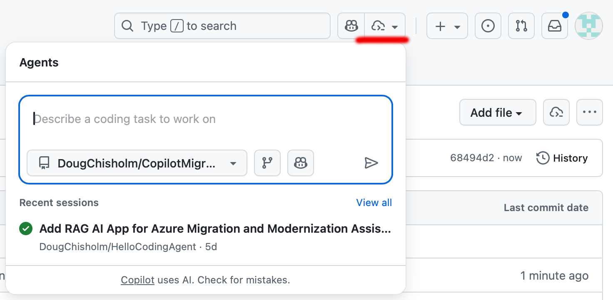

# CopilotMigrateAIS
This repo support Microsoft workshops showing how to use GitHub Copilot / Coding Agent to migrate Integration Workflows to Azure Integration Services (AIS)

# Instructions
Clone this repo then follow these steps to create a plan and POC for migrating a simple systems integration from Boomi to AIS using the .bpr file from Boomi integration. Alternatively follow the steps using the example.bpr file in this repo to see how a SQL<Boomi>Oracle integration would look in AIS.

- Step 1: Add your .bpr file
- Step 2: Copy the text in the Prompts/1_Plan file to use as the instruction for GitHub Coding Agent (Copilot)
- Step 3: Open the coding agent panel in the top right of the screen (making sure you are in the right repo / context):

- Step 4: Paste the instruction and click start task to get the plan
- Step 5: Review the work done by the coding agent by refreshing the "Actions"/"Pull requests" and merge any pull requests
- Step 6: Review the output of any new files such as the plan itself in your repo files
- Step 7: Repeat the process for the next prompt (2_POC)
- Step 8: Review how copilot has structured any new issues it have created and the update plan with POC files
- Step 9: Repeat the prompt process for the next prompt (3_Deployment)
- Step 10: Review the Deployment.md file and test the button to deploy to an Azure sandbox

At any time use the update prompt (4_Update) if you have added more files or setting that copilot asked for. 

By working with GitHub Coding Agent (copilot) in this way you will have a completed backlog of tasks that will help jumpstart any formal Proof of Concepts build in Azure, helping any inbound development team to understand what there is to re-use and how it was built.
